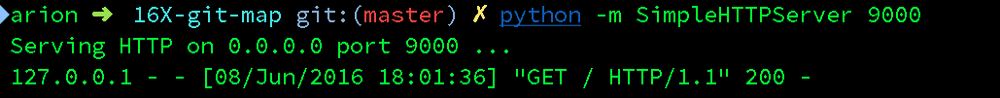
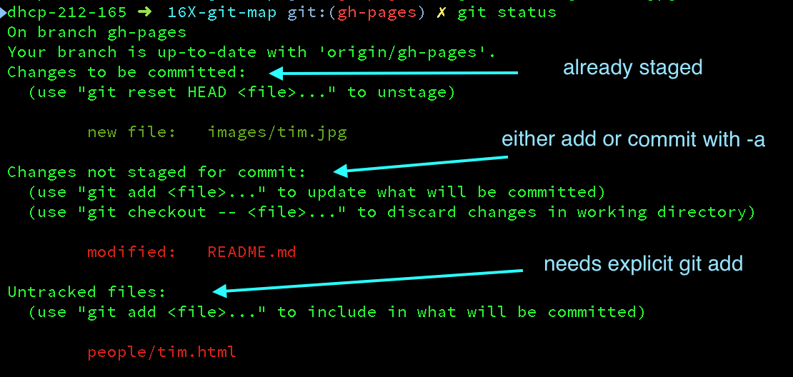

# CS52 Collaborative Coding and Class Page #

Today you'll be learning the ins and outs of an essential concept used in software design and development — version control. We'll be using git and github (the site you're at now!) to learn how manage multiple people working on the same document at the same time — all while having the ability to backup and revert your work. If this is all new to you, don't worry! We'll start from the beginning and build from there.

## Overview

*  Each person will use git to clone this repository.  
*  Then you'll edit some basic html to add a tiny page about yourself to the site.
*  Then you'll commit and merge your changes of the page and push your changes to the git repo.

This mostly assumes that you are using a recent version of OS X, so your mileage may vary.

## Goals at a Glance
Here's what we're going to do!

#### Basic git
1. Clone this repo
1. Create a `branch`
1. Make some edits
  - Modify `index.html`
  - Put a picture of yourself in your repo
  - add a location to the map
1. `add` a file to source control
1. `commit` your changes
1. `pull` master
1. create a `branch`
1. if you need to resolve conflicts
  - fix the conflicts
  - add the fixed files as you did previously
  - `commit`
1. `push`

#### Branches
1. `pull` master
1. Create a `branch`
1. Make some edits
1. `commit`
1. `rebase`

#### Pull Requests
1. `push` our feature branch to github
1. issue a Pull Request and approve it
1. pull request will merge our changes into the main branch
1. view our work!

Key: <br />
🚀steps to definitely pay attention to <br/>
💻run this in Terminal<br />
🍸pro tip<br />


## Setup

**[atom.io](http://atom.io)**
You should already have this. If not, install from [atom.io](http://atom.io).  Open Atom and then do: *Atom -> Install Shell Commands*

**[git+github](http://www.github.com)**
git is a code collaboration tool! You might be able to skip this step if you've previously used git on your computer.

*On Windows use Git Shell for all the Terminal commands*


### Git global configs:
🚀 Setup your global config variables in *Terminal* if you haven't yet:

  💻`git config --global user.name "Jane Doe"`

  💻`git config --global user.email janedoe@example.com`

Ensure that the configs are set up with `cat ~/.gitconfig`. *Email* and *Name* should be filled out.


## 1) Clone the Repository
**What this does:** The repository is what git uses to store your project's information. It contains commits and references to commits (more on this later). The folder on your computer becomes your *workspace*.

From the command line (where you will run all future commands):

1. 🚀Navigate to where you want the repo to end up on your computer. For example:
`mkdir ~/Documents/CS52`
`cd ~/Documents/CS52`
1. 🚀Clone the repo:
`git clone https://github.com/dartmouth-cs52/16X-git-map.git`
1. 🚀change directory to this new workspace:
`cd 16X-git-map`

Some more useful Terminal commands:

* `ls -la`  will list files in current directory
* `pwd`  will show current directory</br>
* `cd  somedirectory`  will change directory to *somedirectory*</br>
* `cp source target` will copy files</br>
* `mv source target` will move</br>

If you need some help or a couple pointers, give a shout!

## Start a local webserver

To view what we currently have the easiest way to start a local webserver is to use Python!

🚀 To run python based webserver in 💻:
```bash
cd 16X-git-map # just make sure you are in the same dir as index.html
python -m SimpleHTTPServer 9000 &
```

<br>
this will start a simple little webserver so you can now access the page in your browser at: [http://localhost:9000](http://localhost:9000)

*If you have Windows you may not have python installed. Install version 2.7.x from [python.org](http://python.org)*


## 2) Edit Some HTML

💻 `atom .` For Windows, just open up atom and use *Add Project Folder* and select the cloned directory from above. *You may need to Atom -> Install Shell Commands on macOS if you get command not found.*

This will open the current folder into the Atom text editor. What are you reading now (in browser) is actually the markdown file **README.md**.  *If you find typos feel free to issue a pull request or ticket!* Now we'll try editing some HTML.

Create a file in the folder `people` and name it `yourname.html`.
Play around and put some html snippets in there. Could be a little bit about yourself. Even just plain text works.

### Images
To insert a new image just put a .jpg or .png in an `images` folder and use the syntax in your html.
```

```

You can view your changes in your browser at:
http://localhost:9000/people/yourname.html


## An Overview of Git
Now that you've made some changes to the site, we'll go over how to use git to add, commit, and push your changes. Git is a code version control system and allows you to have a named log of your changes to the code and a way to work on the same files together with other people. It is sort of like an offline google docs where you *commit* (explicitly name) every set of changes. [Here's a good resource](http://rogerdudler.github.io/git-guide/) but we'll do the basics here.


This is a good overview image for the things you'll be doing — it'll all make sense eventually.


## 3) Git Add

**What this does:** The add step tells git which files from the workspace you want it to track, or add to the index.

  - 🚀**Check your status:** Use `git status` to see what git thinks you have been working on. If you see *untracked* that means git doesn't know that you want to commit those file.
  - 🚀**Add Untracked Files:** Use `git add filename` on those files to tell git to track them.
    - You might also used `git add .` to add all untracked files recursively from the current directory.
  - 🚀Go ahead a try to add your new files now. Run `git status` to make sure they are added.

Here's what this looked like while editing this README:



## 4) Git Commit
**What this does:** Committing files tells git that you want to name and save the changes you have made as a concrete *changeset*. For now this changeset is only saved locally in your local repository. Commits should represent one logical change in the repo and the commit message should make that change clear.

  - 🚀**Commit your changes:** ```git commit -am "i made some changes"```
    - ``-a`` means all changes
    - ``-m`` indicates that your commit message follows directly, a commit message is required.
  - Example of sample commit chains that adds new payments feature to an e-commerce website:
    - "Setup and initialize new Charge Table"
    - "Add API call to generate a new Charge"
    - "Add task that processes new charges"
    - "Add tests to make sure charge amounts are accurate between server and client"

## 5) Git Pull
**What this does:** Git pull will try to fetch and merge the remote repository with your workspace.

  - 🚀**Pull others' changes:** `git pull`
    - This will check the github remote server for any changes and download and merge them into your local version.
    - 🍸Protip: Try using ```git pull --rebase```, this is typically the way open source projects manage their Git workflow.  The difference is that rebasing will pull in all changes from the remote and then apply your commits on top rather than creating a a new "merge" commit. This gives you a cleaner unified git history. Here's a [2 minute read](https://git-scm.com/book/en/v2/Git-Branching-Rebasing) on the differences between merging and rebasing.

### 6) Merge Conflicts

At this point after a `git pull` you may get a message that looks like this:

```
CONFLICT (content): Merge conflict in somefile
Automatic merge failed; fix conflicts and then commit the result.
```

This is when the fun starts.  How do you fix this?

The cause for merge conflicts is that you edited the exact same line as someone else and git doesn't know how to automatically resolve that.  This happens and is normal, don't worry.  So to fix you just need to pick apart the conflict and merge it in — continue to the next section to see how this happens!

#### Deciphering Merge Conflicts

If you were to do this by hand, git takes the pretty code you wrote and injects terrible "conflict markers" that look like this:

```
<<<<<<< HEAD
var h = 'hello, world';
=======
var h = 'Hi!';
>>>>>>> cb1abc6bd98cfc84317f8aa95a7662815417802d
```

where the line between  `<<<HEAD` and `====` is the line/lines of code that are relevant in your file, and between  `====` and `>>>> cb1abc6` are from the remote repository (the repository that you see on github.com). The crazy characters refer to the commit that the change comes from.

Since we've been using Atom so far there is a nice plugin to help visualize this a little better. *Atom -> Preferences -> Install -> search* for merge-conflicts


Once you have your conflict file the way you want it — ie. fixed and without any more of the conflict markers...

- All you have to do to continue is:  `git add thefixedfile` which indicates to git that you have resolved the conflict. Then `git commit` with no options will complete the merge and automatically create a commit message.

### 7) Push Your Commits
**What this does:** Now that you've resolved any conflicts you're ready to push your local changes to the remote repository!

  - 🚀`git push origin gh-pages`
    - `origin` is the remote you are pushing to and is named origin by default
    - `gh-pages` is the branch you are pushing. It happens that because we are hosting this on github.io the default branch is `gh-pages`. Usually you'll be using your own branch or the default which is usually `master`.
    - if this fails, redo step [5](#5\)-Git-Pull)

###You've now published a page!

If you go to http://dartmouth-cs52.github.io/16X-git-map/yournewpage.html now you'll be able to see your new page.


## 8) Map and Javascript


Now lets add a picture of yourself and a lat long for a place that you like or are from.

Open `main.js` in atom.

🚀Find where we run the method `addMarker` to create a marker for Froggy.
Copy that function call and paste it in somewhere in the `SECTION FOR MARKERS`.  

Add an image of yourself into `images`.   It would probably be a good idea to resize your image to be 200x200 pixels. If you don't have a favorite tool for this try [resizeimage](http://resizeimage.net/)

For the `url` field use the new page that you made earlier!

Find a lat long: http://www.latlong.net/

🚀Play around with it till you have a working badge visible on your local dev site:  http://localhost:9000/ and when click on the badge it is able to load in the page you made into the modal.


## 9) Advanced Git Flow

### Recommended Workflow

Here we go through a more in depth git flow that includes code branches and pull requests.  In general if your team is larger than 2 people you should definitely use this!

We're going to create a branch now and try out this new workflow.

### Create a new branch
Start a local feature branch and do work on it. A branch keeps your work separate from the main (usually called *master*) branch.  Think of this as a tree where the *master* (or in our case *gh-pages*) branch can be thought of as the trunk.

Here is a great visualization tool to help see what you are doing in the git tree: [git-with-d3](https://onlywei.github.io/explain-git-with-d3/#branch)

```bash
git branch <feature>  # creates new branch feature
git checkout <feature>  # switches to branch feature
```

🍸Protip: `git checkout -b` will both create a new branch and check it out to make it the current branch you are working on.

🍸Protip: `git branch` will show which branches exist and which you're on (the `*`).


🚀lets name our branch feature with yourname_icon! `git checkout -b yourname_icon`.   (lowercase and no spaces)

🚀if you do `git branch` you should see `* yourname_icon`.


🍸Protip: Periodically pull in changes from *origin/gh-pages* (or *origin/master* in other situations) and update your feature branch.
Note that these commands only update your current local branch.  The idea here is to not fall too far behind the master branch if other people are working on it.

```bash
git pull --rebase origin gh-pages
```

If you have rebase conflicts, fix the files as in [step 6](#Deciphering-Merge-Conflicts) and do `git add`, then
 `git rebase --continue`. Repeat until you're all good.


### Rebase local branch
When you're nearly ready to publish, rebase your local branch on top of the latest master one more time. Just like you have been above. Note: we are using rebasing here per a Protip earlier, cause now we're pros. 🏆 What this does is basically pull in all remote changes and then replay your commits on top of them. This gives you a cleaner version history.

```bash
git pull --rebase origin gh-pages
```

### Push Your Feature Branch

After you are finished working on your branch, you should push it up to github.

```bash
git push origin yourname_icon
```
🍸Protip: git does not push multiple branches by default, but you can with: `git push --all origin`.  Just be careful if you have a ton of test branches lying around.


### Create Pull Request

The best flow to merge your feature into the main branch is to issue a pull request. This bundles up your feature branch into a request that you or someone else on your team can approve.

🚀Go to Github (or use the Github Desktop App) and submit a *New Pull Request* (choosing whatever branch you just pushed), add a quick description. Possibly do code review or just approve the request yourself. The idea here is that this is a checkpoint spot before adding your feature to the main branch so that everybody on your teams knows what is happening.

To do a code review, @mention a peer in the pull request. Once approved, your code changes will be merged.

Alternatively you can merge your changes in to the master branch without a pull request, but this should only be done if you are using git on your own or with a very small team!

```bash
git checkout master
git merge your_feature_branch_name
```

**Once you no longer need a branch you should delete it!**
You can do this on github and locally with `git branch -d your_feature_branch_name`.
Note: you have to delete it in both places, as just deleting it remotely won't delete it locally.


## DONE!!

Once your changes are merged into the remote `gh-pages` branch on github you'll be able to see your changes at: http://dartmouth-cs52.github.io


## Additional Git Tips and Resources:

[Git CheatSheet](http://www.ndpsoftware.com/git-cheatsheet.html#loc=workspace)

#### Sample Git Config
To edit `atom ~/.gitconfig`

```bash
[user]
    name = John Doe
    email = johndoe@dali.dartmouth.edu
[alias]
    pullorigin="pull --rebase origin"   # tweak naming to whatever, but a nice shortcut to ensure --rebase
    co="checkout"
    st="status"
    br="branch"
[branch]
    autosetuprebase = always    # set rebase to be default for new branches
[push]
    default = simple
```

Setting up `git push` to use `simple` matching is very important. Otherwise it
is easy, while you're force-pushing a feature branch, to also accidentally force
push your master to the prod repo. See [here](http://stackoverflow.com/a/13148313)
for a good explanation.

### Optional Cleaning up of local branch history
You might want to consider cleaning up your local branch history. It's a good
idea to commit frequently as checkpoints to save your work, but if you have a
lot of them, the shared repo history will look cleaner without them.

A nice way to visualize your commits and branches locally is `git log --graph --oneline`. Alternatively, use a GUI like GitX (http://rowanj.github.io/gitx/).

Then, rebase with up git "interactive" mode, which will pull up your text editor.
```bash
git rebase -i master
```
OR
```bash
git rebase -i HEAD~X
```
where X is the number of commits back you want to roll back, OR
```bash
git rebase -i xxxxxx
```
where xxxxxx is the commit id, which you can get from `git log`.

To squash a commit into the previous one, replace "pick" with "s" or "squash" and save the file.


This is the screen you will see after typing `git rebase -i`.
This file will be launched in your default text editor.
You have many different options, typically `squash` is the most useful.


By changing the character in front of the second commit to `s`,
we are "combining" the second commit into the first commit.
To finish, save and exit on your text editor (:wq in Vim).


After squashing, you have to write a new commit message.
Again to finish, save and exit on your text editor. Done!

**Note:** this can cause problems if you've pushed your branch to your remote repo, since you are rewriting commit history in your local branch and this will mismatch with the remote repo's history. Best to do this before pushing, but if you've done a rebase commit squash on commits that you already pushed, then the next time you push to the remote repo you will have to do a forced update `git push -f origin feature`. However be aware that this is dangerous and anyone else working on this feature branch will have issues pushing their branch. One solution to this is asking them to `stash` their commits and then `rebase` after you push your branch. You've been warned.


#### Useful Commands

##### Push local branch to your remote repo

```bash
git push -u origin <feature>
```
`-u` is short for `--set-upstream`, which will set up your local branch to pull automatically from this newly pushed branch. However it's optional.

##### Delete remote branch
```bash
git push origin --delete <feature>
```

##### Delete local branch
```bash
git branch -D <feature>
```

##### Checkout a remote branch
```bash
git checkout <feature>     # shorter version, works with newer versions of Git
```

##### Reset your branch to some other branch

Be careful about this!! You will lose your local changes.
```bash
git reset --hard mybranch goodbranch
git reset --hard master origin/master   
```

##### Grab a commit from another branch
Sometimes you commit to the wrong branch. Figure out the commit ID of the commit
you want to grab.
```bash
git cherry-pick <COMMIT ID>
```

#### Basic guidelines
- Try to use `git rebase` commands when possible rather than `git merge`, so we
can have a cleaner and more linear Git commit history (that said, merge commits do have their place).
- Use local branches to do most of your more involved work (this also lets you
  quickly switch between different features, or pause work on a feature to work on a bug fix).
- The general idea is to try to resolve conflicts locally (by pulling in changes
  from the shared repo before pushing), so merging into master (either manually
    or by Github pull request merge should be simple and automatic)

#### Some more Pro-tips
- If you are doing a complex rebase merge fix, if you squash your commits first
(see earlier notes about rebase interactive), you can do your manual merge fixes
in fewer, as there are fewer commits to have to edit. Otherwise you may be opening
your text editor a lot.


#### Git Bash Scripts
- Add the following to your `.bash_profile` to see your current branch and status
within the command line prompt:


```bash
# Prompt to add branch and status to the command line
COLOR_RED="\[\e[31;40m\]"
COLOR_GREEN="\[\e[32;40m\]"
COLOR_CYAN="\[\e[36;40m\]"
COLOR_RESET="\[\e[0m\]"

function git_branch_name {
  ref=$(git symbolic-ref HEAD 2> /dev/null) || return
  echo " ("${ref#refs/heads/}")"
}

function git_branch_color {
  if [[ $(git status 2> /dev/null | grep -c :) == 0 ]]
    then echo "${COLOR_GREEN}"
    else echo "${COLOR_RED}"
  fi
}

function prompt_title {
  PS1="\w$(git_branch_color)$(git_branch_name)${COLOR_RESET} \$ "
}

PROMPT_COMMAND=prompt_title
```

#### Git Autocompletion
This will allow you to do `git checkout TAB` for a list of branches. First, download the git autocompletion support for bash.

```bash
curl https://raw.githubusercontent.com/git/git/master/contrib/completion/git-completion.bash -o ~/.git-completion.bash
```

Then, add the following to your `~/.bash_profile`.

```bash
if [ -f ~/.git-completion.bash ]; then
  . ~/.git-completion.bash
fi
```
More information can be found [here](http://apple.stackexchange.com/questions/55875/git-auto-complete-for-branches-at-the-command-line)
