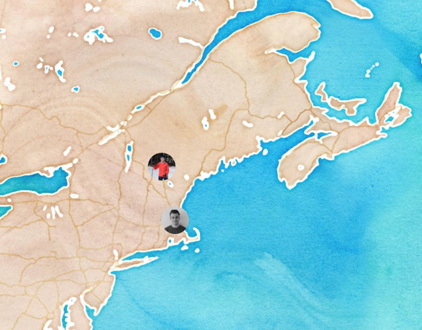

# DALI Collaborative Coding and Design

Today you'll learn a bunch of things to help prep you for your 17W term in DALI! Try your hand at some design and some web coding as well as the ins and outs of an essential concept used in software design and development — version control. We'll be using git and github (the site you're at now!) to learn how manage multiple people working on the same document at the same time — all while having the ability to backup and revert your work. If this is all new to you, don't worry! We'll start from the beginning and build from there.

## Overview

DALI members are pretty cool, so we'd like each of you to design a web page telling us about yourself! It's up to you whether you want to build your page using html/css/js (follow details in [Dev Details](./docs/dev_details.md)) or if you want to create your design in Sketch (follow details in [Design Details](./docs/design_details.md)). If you're feeling adventurous, try both! How much you do is up to you, but at the very least, complete either the design or the dev flow. Be creative! Your design should tell us something about your personality, so consider this when you make choices about type, color, and decisions about your layout.

*  Each person will use git to clone this repository.  
*  Then you'll edit some basic html to add a page about yourself to the site.
*  You can either practice html/css/js for your page or design it in Sketch.
*  Then you'll commit and merge your changes of the page and push your changes to the git repo.

This mostly assumes that you are using a recent version of OS X, so your mileage may vary.

## Your Map Page:

### Your page should include the following information:
* A picture of yourself
* Your name
* Where you’re from/where you live
* A short bio telling us about yourself (you might include/mention: design/programming applications you know/like, what you enjoy most about ui/ux design/development, why you’re excited to work with DALI.)
* Something interesting/fun/random about yourself :smile:

Note: remember to fill out the [DALI Personnel Details Form](https://goo.gl/forms/7oOlYXL6W3kBDX4k1) to be added to the github team!

## Design

[Design Details](./docs/design_details.md)

## Dev

[Dev Details](./docs/dev_details.md)
