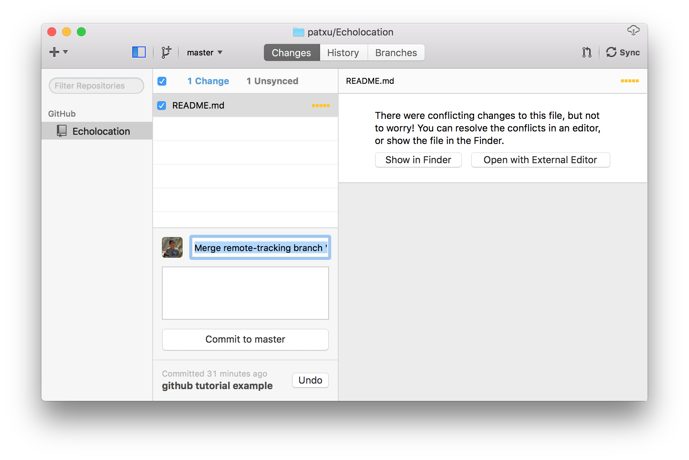

# DALI GITivity #

Today you'll be learning the ins and outs of an essential concept used in software design and development — version control. We'll be using git and github (the site you're at now!) to learn how manage multiple people working on the same document at the same time — all while having the ability to backup and revert your work. If this is all new to you, don't worry! We'll start from the beginning and build from there.

## Overview

*  In your groups, each person will use git to clone a version of your team's git repository.  
*  Then you'll edit some markdown (very simple code) in the README.md file.
*  Then you'll commit and merge your changes of the page with your teammates and push your changes to the git repo.

This mostly assumes that you are using a recent version of OS X, so your mileage may vary.

## Goals at a Glance
Depending on your role, this is what you will accomplish by the end of this guide!

#### Basic: Everybody!
1. Clone your repository
1. Make some edits
  - Modify `README.md` by adding your name
  - Put a picture of yourself in your repo
1. `add` this file to source control
1. `commit` your changes
1. `pull`
1. if you need to resolve conflicts
  - fix the conflicts
  - add the fixed files as you did previously
  - `commit`
1. `push`

#### Advanced: For those who know some git already.
1. `pull` master
1. Create a `branch`
1. Make some edits
1. `commit`
1. `merge`
  - Alternatively, `rebase`

## Setup

* ### [atom.io](http://atom.io)
This is a great code editor, it is cross platform and looks pretty. If you prefer a different editor you can use that one instead.

1. Install from [atom.io](http://atom.io)
1. Open Atom and then do: *Atom -> Install Shell Commands*

* ### [git+github](http://www.github.com)
git is a code collaboration tool! You might be able to skip this step if you've previously used git on your computer.

1. Create an account at [github.com](http://github.com). If you need to do this step, make sure you also let someone know so you can be added to your team's repository.

#### Designers
1. Install the github app from here: [Mac](http://mac.github.com) or [PC](http://windows.github.com).
1. Run the *GitHub* app, and set up with your new account.
1. Go to *Preferences* -> *Advanced* and fill in your information with the same email you used for your github account and then click *Install Command Line Tools*

1.  Now **Exit** the app.

#### Developers
1. Set up your global config variables in *Terminal* with:
```
git config --global user.name "John Doe"
git config --global user.email johndoe@example.com
```

* no other tools will be necessary but for the future here's a recommended [list of DALI recommended dev tools](https://github.com/dali-lab/dev-resources).

## 1) Clone your Respository
**What this does:** The repository is what git uses to store your project's information. It contains commits and references to commits (more on this later). The folder on your computer becomes your *workspace*.

1. Find your team's github repository on [github.com](http://github.com/dali-lab) and go to its page.
1. You'll use the repository URL in the next step, so leave this page open.


### Designers
1. From your Github app, clone the team repo


### Developers
1. From the command line (where you will run all future commands), navigate to where you want the repo to end up on your computer. For example:
`cd ~/Documents`
1. Clone the repo:
`git clone [repo-URL]`
1. Enter your repo:
`cd [my-dali-project]`

Some more useful Terminal commands:

  ```ls -la```  will list files in current directory </br>
  ```pwd```  will show current directory</br>
  ```cd  somenewdirectory```  will change directory to *somenewdirectory*</br>
  ```cp source target``` will copy files</br>
  ```mv source target``` will move</br>

If you need some help or a couple pointers, give me a shout!

## 2) Editing Markdown

  -  In Terminal run:  ```atom .``` For Windows, just open up atom and use 'Add Project Folder' and select the cloned directory from above.  

This will open the current folder into the Atom text editor. What are you reading now (in browser) is actually a markdown file **README.md**. Here's a [wonderful cheat sheet](https://github.com/adam-p/markdown-here/wiki/Markdown-Cheatsheet) that'll help you make your markdown files look awesome!

Play around and make some changes. In particular create an "Authors:" line and add yourself! Add some images!

#### Images
To insert a new image just put a .jpg or .png in the img folder (make sure it is square) and change the ```img src=``` line.

Pro Tip: Get a preview of your markdown file right inside Atom go to *Packages -> Markdown Preview -> Toggle Preview*, or the shortcut *SHIFT-CTRL-M*.

## An Overview of Git
Now that you've made some changes to the site, we'll go over how to use git to add, commit, and push your changes. Git is a code version control system and allows you to have a named log of your changes to the code and a way to work on the same files together with other people. It is sort of like an offline google docs where you *commit* (explicitly name) every set of changes. [Here's a good resource](http://rogerdudler.github.io/git-guide/) but we'll do the basics here. This is a good overview image for the things you'll be doing. **Devs should pay close attention to this!**


## 3) Git Add

**What this does:** The add step tells git which files from the workspace you want it to track, or index.

### Designers
  - The Github app does this for you so you can move on!

### Developers
  - **Check your status:** Use ```git status``` to see what git thinks you have been working on. If you see *untracked* that means git doesn't know that you want to commit those file.
  - **Add Untracked Files:** Use ```git add filename``` on those files to tell git to track them.
    - You might also used `git add -a` to add all untracked files at once

## 4) Git Commit
**What this does:** Committing files tells git to stage the files for upload to the remote repository. These staged files are known as your *local repository*. Commits should represent one logical change in the repo and the commit message should make that change clear.

### Designers
  - New and modified files will show up in the center pane of the Github app. Choose which files you want to commit, write a commit message and then press *Commit to Master* in the bottom center.
  
  - Continue to commit files until you see "No Uncommitted Changes"

### Developers
  - **Commit your changes:** ```git commit -am "i made some changes"```
    - ``-a`` means all changes
    - ``-m`` indicates that your commit message follows directly, a commit message is required.

## 5) Git Pull
### Designers
  - Again, the Github app a couple of these next steps together. For now, press the "Sync" button in the top right. This will first pull, then try to push to the remote repository.

### Developers
  - **Pull your teammates changes:** ```git pull```
    - This will check the github remote server for any changes and download and merge them into your local version.

### 6) Merge Conflicts
#### Designers
  - After clicking "Sync" you might get a message that looks like this:
  
  - This is where the fun starts- how do you fix this?
    - The cause for merge conflicts is when you edited the exact same line as someone else and git doesn't know how to automatically merge that. So to fix you just need to pick apart the conflict and merge it in.
  - Instead of "No Uncommitted Changes," you should now see something like "1 Change"- this is the conflicted file!
  
  - You already have this file open in your editor. Continue to the section **Deciphering Merge Conflicts**.

#### Developers
At this point after a ```git pull``` you may get a message that looks like this:

     CONFLICT (content): Merge conflict in somefile
     Automatic merge failed; fix conflicts and then commit the result.

This is when the fun starts.  How do you fix this?

The cause for merge conflicts is when you edited the exact same line as someone else and git doesn't know how to automatically merge that. So to fix you just need to pick apart the conflict and merge it in- continue to the next section to see how this happens!

#### Deciphering Merge Conflicts

If you were to do this by hand, git takes the pretty code you wrote and injects terrible "conflict markers" that look like this:

    <<<<<<< HEAD
    var h = 'hello, world';
    =======
    var h = 'Hi!';
    >>>>>>> cb1abc6bd98cfc84317f8aa95a7662815417802d

where the line between  ```<<<HEAD``` and ```====``` is the line/lines of code that are relevant in your file, and between  ```====``` and ```>>>> cb1abc6``` are from the remote repository (the repository that you see on github.com). The crazy characters refer to the commit that the change comes from.

Since we've been using Atom so far there is a nice plugin to help visualize this a little better.

  <br> Atom -> Preferences -> Install -> search for merge-conflicts
  


Once you have your conflict file the way you want it fixed and without any more of the conflict markers...

#### Designers
- Commit the files like you learned in step 4

#### Developers
- All you have to do to continue is:  ```git add thefixedfile``` which indicated to git that you have resolved the conflict. Then ```git commit``` with no options will complete the merge and automatically create a commit message.

### 7) Push Your Commits
**What this does:** Now that you've resolved any conflicts you're ready to push your local changes to the remote repository!

#### Designers
  - All you need to do is hit that Sync button again! Go ahead to your github page and see the live changes.

#### Developers
  - ```git push origin master```
    - ```origin``` is the remote you are pushing to and is named origin by default
    - ```master``` is the branch you are pushing

###Done!

If you go to your repository github page now you'll be able to see all the changes you made to the readme!

## Advanced Git for Devs

Setting up SSH keys

[Read this guide here](https://help.github.com/articles/generating-an-ssh-key/)

Setting up Git Config

```
git config --global user.name "Your Name"
git config --global user.email <yourgithubemail>
git config --global push.default simple   # this is much safer than 'matching'
```

#### Then add the aliases and branch configs
```
atom ~/.gitconfig  # or whatever texteditor you prefer
```

#### Sample
```
[user]
    name = John Doe
    email = johndoe@dali.dartmouth.edu
[alias]
        pullorigin="pull --rebase origin"   # tweak naming to whatever, but a nice shortcut to ensure --rebase
[branch]
        autosetuprebase = always    # set rebase to be default for new branches
[push]
    default = simple
```

Setting up `git push` to use `simple` matching is very important. Otherwise it is easy, while you're force-pushing a feature branch, to also accidentally force push your master to the prod repo. See [here](http://stackoverflow.com/a/13148313)for a good explanation.

## Recommended Workflow

```
git clone git@github.com:dali-lab/gitivity.git
```
This will set up origin to point to the dali-lab/gitivity repo.

### Work on Code
- Start a local feature branch and do work on it
```
git checkout -b <feature>
git add <file>
git commit -m 'commit message'
```

- Periodically pull in changes from origin/master and update your feature branch.
Note that these commands only updates your current branch

```bash
git pull --rebase origin master
```
or
```bash
git pullorigin master
```

- When you're nearly ready to publish, rebase your local branch on top of the latest master.
```
git checkout <feature>  # make sure you're on your branch
git pull --rebase origin master   # rebase on top of the remote master
```

 If you have rebase conflicts, fix the files manually and do `git add`, then `git rebase --continue`. Repeat until you're all good.

### (Optional) Clean up branch history
You might want to consider cleaning up your local branch history. It's a good idea to commit frequently as checkpoints to save your work, but if you have a lot of them, the shared repo history will look cleaner without them.

Rebase with up git "interactive" mode, which will pull up your text editor. To squash a commit into the previous one, replace the "p" with an "s", and save the file.
```
git rebase -i master
```

OR
```
git rebase -i HEAD~X
```
where X is the number of commits back you want to roll back

Note that this can cause problems if you've pushed your branch to your remote repo, since you are rewriting commit history in your local branch and this will mismatch with the remote repo's history. If you've done a rebase commit squash, the next time you push to the remote repo you will have to do a forced update `git push -f origin feature`. However be aware that this is dangerous and anyone else working on this feature branch will have issues pushing their branch. One solution to this is asking them to `stash` their commits and then `rebase` after you push your branch.

After you are finished working on your branch

```
git push origin feature
```

Then go to Github and submit a pull request (choosing whatever branch you just pushed), add a quick description. Possibly do code review. Close the request.

To do a code review, @mention a peer in the pull request. Once approved, your code changes will be merged.

**You should also delete the branch in Github.**

##6) Additional Git Things

### Useful Commands

##### Push local branch to your remote repo

```
git push -u origin newfeature    
```
-u is short for --set-upstream, which will set up your local branch to pull automatically from this newly pushed branch. However it's optional.

##### Delete remote branch
```
git push origin --delete <feature>
```

##### Delete local branch
```
git branch -D <feature>
```

##### Checkout a remote branch
```bash
git checkout feature     # shorter version, works with newer versions of Git
```

##### Reset your branch to some other branch

Be careful about this!! You will lose your local changes.
```bash
git reset --hard mybranch goodbranch
git reset --hard master origin/master   
```

##### Grab a commit from another branch
Sometimes you commit to the wrong branch. Figure out the commit ID of the commit you want to grab.
```
git cherry-pick <COMMIT ID>
```

### Basic guidelines
- Try to use "git rebase" commands when possible rather than "git merge", so we can have a cleaner and more linear Git commit history (that said, merge commits do have their place).
- Use local branches to do most of your more involved work (this also lets you quickly switch between different features, or pause work on a feature to work on a bug fix).
- The general idea is to try to resolve conflicts locally (by pulling in changes from the shared repo before pushing), so merging into master (either manually or by Github pull request merge should be simple and automatic)

### Pro-tips
- If you are doing a complex rebase merge fix, if you squash your commits first (see earlier notes about rebase interactive), you can do your manual merge fixes in fewer, as there are fewer commits to have to edit. Otherwise you may be opening your text editor a lot.
- A nice way to visualize your Git branches locally is by using GitX (http://rowanj.github.io/gitx/).
-Add the following to your .bash_profile to see your current branch and status within the command line prompt:

```
# Prompt to add branch and status to the command line
COLOR_RED="\[\e[31;40m\]"
COLOR_GREEN="\[\e[32;40m\]"
COLOR_CYAN="\[\e[36;40m\]"
COLOR_RESET="\[\e[0m\]"

function git_branch_name {
  ref=$(git symbolic-ref HEAD 2> /dev/null) || return
  echo " ("${ref#refs/heads/}")"
}

function git_branch_color {
  if [[ $(git status 2> /dev/null | grep -c :) == 0 ]]
    then echo "${COLOR_GREEN}"
    else echo "${COLOR_RED}"
  fi
}

function prompt_title {
  PS1="\w$(git_branch_color)$(git_branch_name)${COLOR_RESET} \$ "
}

PROMPT_COMMAND=prompt_title
```

Add the following to your .bash_profile for Git Autocompletion. This way you can `git checkout TAB` for branches

```
if [ -f ~/.git-completion.bash ]; then
  . ~/.git-completion.bash
fi
```
More information can be found [here](http://apple.stackexchange.com/questions/55875/git-auto-complete-for-branches-at-the-command-line)
