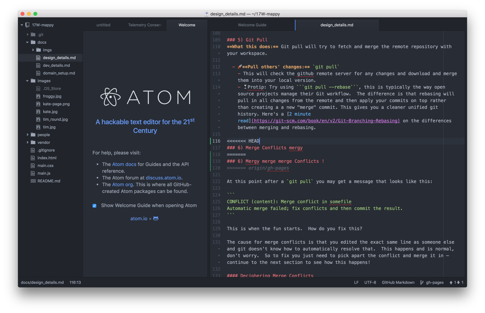
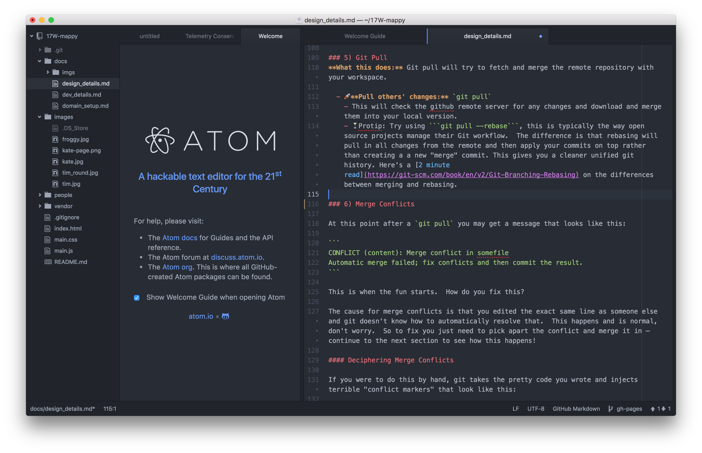

# Design Task

This task is to help you gain familiarity with Sketch, a powerful UI/UX design application, to get your design chops warmed up before the beginning of the term! And to get set up with Atom and Git.

## Before you begin
1. Download a free trial of Sketch from: https://sketchapp.com.  
2. Watch the short Sketch tutorials on *Introducing Symbols*, *Symbol Resizing*, and *Using Masks*: https://sketchapp.com/learn/.

## Part 1: Design Your Page Using Sketch

### Your page should include 2 sections:
1. Your bio
2. A style guide

### For Your Bio:

The design of your bio should include:

* A picture
* Your name
* Where you’re from/where you live
* A short bio telling us about yourself (you might include/mention: design applications you know, what you enjoy most about ui/ux design, why you’re excited to work with DALI)
* And something interesting about yourself :-)

* Create a complex symbol to use in your design, duplicate the symbol, and use the override option to change information in your symbol.

* Create a mask to crop some content on your page.

### For Your Style Guide:

Your style guide should include:

* A short description/rationale explaining your design choices
* Type styles — include the name of the typeface, sizes, styles, and colors used
* Color palette — include swatches and hex codes


## Part 2: Setup Git & Atom

You'll use Atom and the Github app to submit a PDF of your final design. Follow the instructions below to add your page to the DALI Map!

### Download & Install Atom
Atom is a great code editor, it is cross platform and looks pretty. If you prefer a different editor you can use that one instead. If you already have Atom installed, you can skip this section.

1. Install from http://atom.io

2. Open Atom and then do: Atom -> Install Shell Commands

### Install Github Desktop App & Add The Project Repo
git is a code collaboration tool! If you've previously used git on your computer, you can skip the install step.

1. Install the github app from: https://desktop.github.com/

2. Run the GitHub app, and set it up with your new account.


3. Go to Preferences -> Advanced and fill in your information with the same email you used for your github account and then click Install Command Line Tools

4. Clone the 17W-mappy repo: click the + Add a Repository dropdown, select clone, and choose the 17W-mappy


### Add the Project Repo in Atom

In Atom, go to: File -> Add Project Folder, and select the 17w-mappy repo.


## Part 3: Use Atom & Git to Publish Your Work
Now you'll use git to add, commit, and push your changes. Git is a code version control system and allows you to have a named log of your changes to the code and a way to work on the same files together with other people. It is sort of like an offline google docs where you *commit* (explicitly name) every set of changes. [Here's a good resource](http://rogerdudler.github.io/git-guide/) but we'll do the basics here.

This is a good overview image for the things you'll be doing — it'll all make sense eventually.


### Step 1) Add Your Images to Your Local Git Repo

1. Export your design from Sketch as a PDF 
2. Locate the images directory in your local project repo. If you're not sure where Git set this up, you can right-click the 17W-mappy repo in the Git app, and select Open in Finder.
3. Add 2 files to the images directory:
  * A bio pic — must be square, 200 x 200px (this will show up on the map). If you don't have a favorite tool for this try [resizeimage](http://resizeimage.net/)
  * The PDF of the design you created in Sketch
  
### Step 2) Create a Javascript Marker on the Map

Now you're ready to create a marker on the DALI Map with your bio pic! This marker will be placed at a geographic location you specify and will link to the pdf file you exported from Sketch.

1. Open `main.js` in atom.

2. Find where we run the method `addMarker` to create a marker for Froggy. Copy that function call and paste it in somewhere in the `SECTION FOR MARKERS`.  

3. Update the Javascript function to call your information:
  * Change the `iconUrl` field to point to your bio pic, which should be saved in the images directory
  * Change the `url` field to point to the PDF file
  * Add a lat long: http://www.latlong.net/

4. Save the file.

### Step 3) Commit & Sync Your Changes with Gitapp
Committing files tells Git that you want to name and save the changes you have made as a concrete *changeset*. For now this changeset is only saved locally in your local repository. Commits should represent one logical change in the repo and the commit message should make that change clear.

In Gitapp:

1. Write a short note in the summary field about what you did/what changes you made (e.g. added images and html file).

2. Commit your changes.

3. Sync your changes with the server (this will run a pull to update your changes locally, and then a push to update the Github server).


Check the map to make sure your bio picture is showing and the page you designed in Sketch shows up when you click your photo!
https://dali-lab.github.io/17W-mappy/


## Help & Troubleshooting
### Git Conflicts
Since multiple people can be working on the same file at the same time, it's possible that you might edit the exact same line in a file as someone else. When this happens, Git doesn't know how to automatically resolve it and you will get message that looks like this:


This happens and is normal, so don't worry! To fix you just need to pick apart the conflict and merge it in.

### Deciphering Merge Conflicts

If you were to do this by hand, git takes the pretty code you wrote and injects terrible "conflict markers" that look like this:

```
<<<<<<< HEAD
### 6) Merge Conflict mergy
=======
### 6) Mergy merge merge Conflicts !
>>>>>>> *origin/ghpages*
```
where the line between  `<<<HEAD` and `====` is the line/lines of code that are relevant in your file, and between  `====` and `>>>> origin/ghpages` are from the remote repository (the repository that you see on github.com). This line refers to the commit that the change came from.

In atom, this looks like:


* `origin` is the remote you are pushing to and is named origin by default
* `gh-pages` is the branch you are pushing. It happens that because we are hosting this on github.io the default branch is `gh-pages`. Usually you'll be using your own branch or the default which is usually `master`.

Since we've been using Atom so far there is a nice plugin to help visualize this a little better. *Atom -> Preferences -> Install -> search* for merge-conflicts




Once you have your conflict file the way you want it — ie. fixed and without any more of the conflict markers, all you have to do to continue is:
* Save your file in Atom
* Commit the change in Gitapp
* And sync!
   

### You've Published a Page!

If you go to https://dali-lab.github.io/17W-mappy/ and click your marker on the map, you'll be able to see your new page!


