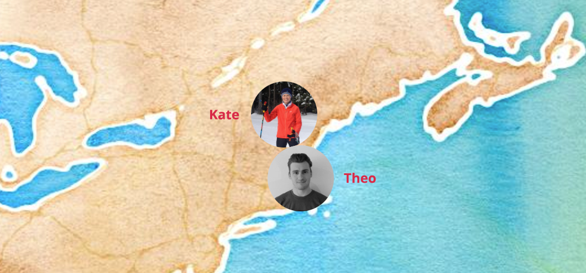
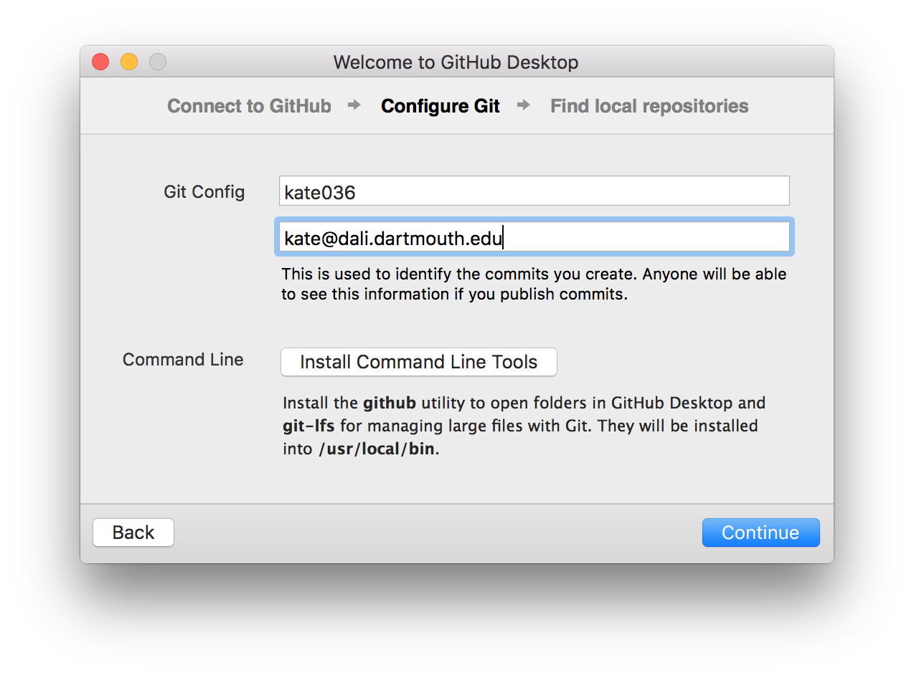
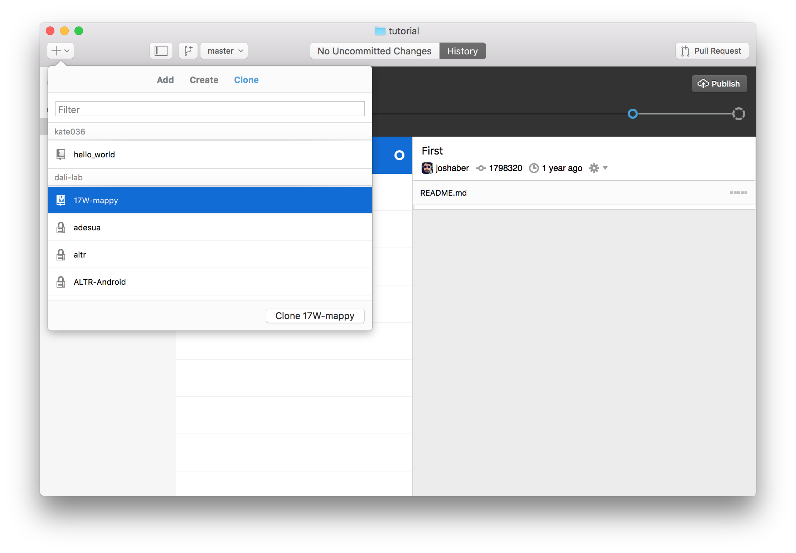
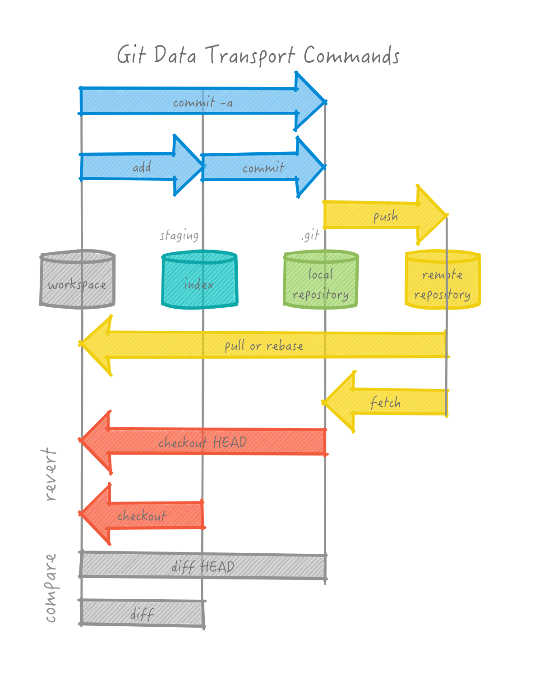
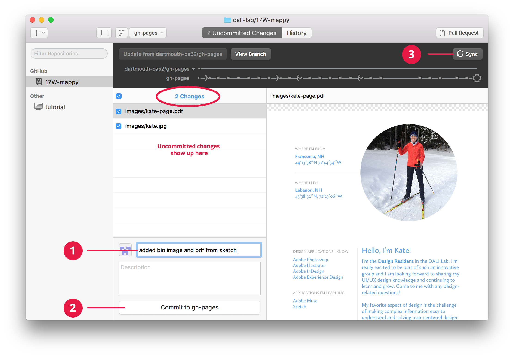
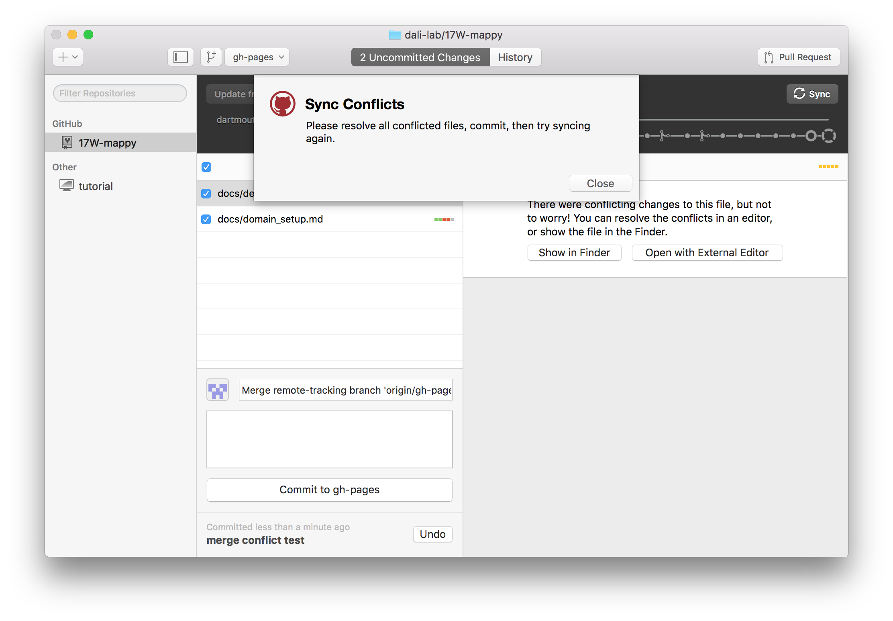
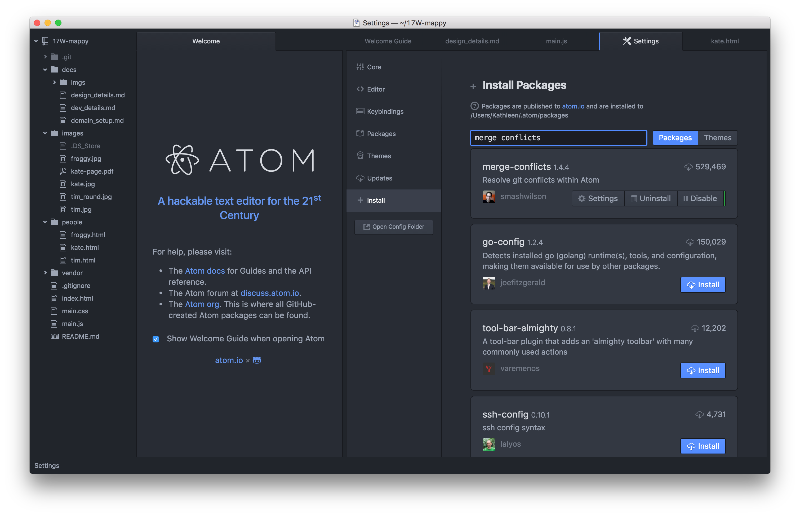

# Design Task

This task will help you gain familiarity with Sketch, a powerful UI/UX design application. You'll get some practice designing in the application before the beginning of term, explaining your design decisions, creating a simple style guide, and you'll also get set up with Atom and Git.

## Before you begin
1. Download a free trial of Sketch from: https://sketchapp.com.  
2. Watch the short Sketch tutorials on *Introducing Symbols*, *Symbol Resizing*, and *Using Masks*: https://sketchapp.com/learn/.

If you want to see an example of what you'll be doing, go to the map, zoom in and look at me (Kate) and Theo. Map is here: https://dali-lab.github.io/17W-mappy/ (If you're using Safari and don't see the map at all, switch to Chrome.) 



***
## Part 1: Design Your Page Using Sketch

### Your page should include 2 sections:
1. Your bio
2. A style guide

### For Your Bio:

The design of your bio should include:

* A picture
* Your name
* Where you’re from/where you live
* A short bio telling us about yourself (you might include/mention: design applications you know, what you enjoy most about ui/ux design, why you’re excited to work with DALI)
* And something interesting about yourself :-)

* Create a complex symbol to use in your design, duplicate the symbol, and use the override option to change information in your symbol. Watch the Sketch tutorial on *Introducing Symbols* for direction on this. https://www.youtube.com/watch?v=3fcIp5OXtVE

* Create a mask to crop some content on your page. Watch the Sketch tutorial on *Using Masks* https://www.youtube.com/watch?v=4_1mcizltcM

### For Your Style Guide:

Your style guide should include:

* A short description/rationale explaining your design choices
* Type styles — include the name of the typeface, sizes, styles, and colors used
* Color palette — include swatches and hex codes

Visit my page to see an example style guide: http://dalikate.me/kate-page.pdf

***
## Part 2: Setup Git & Atom

You'll use Atom and the Github app to submit a PDF of your final design. Follow the instructions below to add your page to the DALI Map!

### Step 1. Download & Install Atom
Atom is a great code editor, it is cross platform and looks pretty. If you prefer a different editor you can use that one instead. If you already have Atom installed, you can skip this section.

1. Install from http://atom.io

2. Open Atom and then do: Atom -> Install Shell Commands

### Step 2. Install Github Desktop App & Add The Project Repo
Git is a code collaboration tool. If you've previously used git on your computer, you can skip the install step. If you haven't used GitHub before, you'll have to create a new account before you begin. Be sure to verify your email address before you start these next steps or you'll have trouble publishing your work in the next part! After you've created your account, Git will send you an email asking you to verify your email. Go to: https://github.com/ to sign up.

1. Install the github app from: https://desktop.github.com/ 

2. Run the GitHub app, and set it up with your new account.


3. Go to Preferences -> Advanced and fill in your information with the same email you used for your github account and then click Install Command Line Tools.

4. Clone the 17W-mappy repo: click the + Add a Repository dropdown, select clone, and choose the 17W-mappy.



### Step 3. Add the Project Repo in Atom

In Atom, go to: File -> Add Project Folder, and select the 17W-mappy repo.

***
## Part 3: Use Atom & Git to Publish Your Work
Now you'll use git to add, commit, and push your changes. Git is a code version control system and allows you to have a named log of your changes to the code and a way to work on the same files together with other people. It is sort of like an offline google docs where you *commit* (explicitly name) every set of changes. [Here's a good resource](http://rogerdudler.github.io/git-guide/) but we'll do the basics here.

This is a good overview image for the things you'll be doing — it'll all make sense eventually.



### Step 1. Add Your Files to Your Local Git Repo

1. Export your design from Sketch as a PDF 
2. Locate the images directory in your local project repo. If you're not sure where Git set this up, you can right-click the 17W-mappy repo in the Git app, and select Open in Finder.
3. Add 2 files to the images directory:
  * A bio pic — must be square, 200 x 200px (this will show up on the map). If you don't have a favorite tool for this try [resizeimage](http://resizeimage.net/)
  * The PDF of the design you created in Sketch
  
### Step 2. Create a Javascript Marker on the Map

Now you're ready to create a marker on the DALI Map with your bio pic! This marker will be placed at a geographic location you specify and will link to the pdf file you exported from Sketch.

1. Open `main.js` in atom.

2. Find where we run the method `addMarker` to create a marker for Froggy. Copy that function call and paste it in somewhere in the `SECTION FOR MARKERS`.  

3. Update the Javascript function to call your information:
  * Change the `iconUrl` field to point to your bio pic, which should be saved in the images directory
  * Change the `url` field to point to the PDF file
  * Add a lat long: http://www.latlong.net/

4. Save the file.

### Step 3. Commit & Sync Your Changes with Gitapp
Committing files tells Git that you want to name and save the changes you have made as a concrete *changeset*. For now this changeset is only saved locally in your local repository. Commits should represent one logical change in the repo and the commit message should make that change clear.

In Gitapp, you'll do the following (read through the steps and look at the screenshot below):

1. Write a short note in the summary field about what you did/what changes you made (e.g. added bio image and pdf).

2. Commit your changes.

3. Sync your changes with the server (this will run a pull to update your changes locally, and then a push to update the Github server).



Check the map to make sure your bio picture is showing and the page you designed in Sketch shows up when you click your photo!
https://dali-lab.github.io/17W-mappy/

If everything works, you're all set! To learn how to set up your own domain, and get more practice with Git, move on to the next section! This part is optional, so it's up to you!

If you're having trouble getting things to work, you might check the following:

* If you don't see your photo on the map, it might take a minute or two for it to display. Try refreshing your browser to see if that works. 

* If you make an update and sync some new changes with the server, and you don't see them load right away, it's probably a caching issue. In Chrome: open a new Incognito window, load the map page, and see if you see your updates. If you do, you're all set, it was a caching problem.

* If you need help resolving a merge conflict error you received in Gitapp, scroll down to the Help & Troubleshooting section for more information on what these are and how to resolve them.


***
## Optional: Create Your Own Domain!

### Step 1. Register Your Domain

Namecheap has free domains for students. Go to: https://nc.me/ and register your domain!
![Namecheap Domains] (imgs/namecheap_hp.png)

1. Add your domain
![Add Your Domain] (imgs/dalikate-1.png)

2. Select your options, scroll down, and enter your dartmouth.edu email address
![Domain Options] (imgs/dalikate-2-options.png)

3. Check your email and click the button to verify your email
![Verify Your Email] (imgs/dalikate-3-verifyemail.png)

4. Click "Register"
![Register] (imgs/dalikate-4-clickregister.png)

5. Fill out the form and confirm your order
![Confirm Your Order] (imgs/dalikate-5-confirm.png)

6. Set up Your Git Account
![Set up Git] (imgs/dalikate-6-gotogit.png)

### Step 2. Create a New Repo & Link Your Domain
If the previous step didn't take you over to Github, go to: http://github.com and log in to your account if you're not already logged in.

#### Create A New Repo & Add Your Design (PDF)
1. Create a new repository. (Use the domain name you just registered with namecheap, e.g. my new repo is called "dalikate".)
![Create New Repo] (imgs/dalikate-git1-newrepo.png)

2. You can either click the "Setup in Desktop" button, or hop over to Gitapp to create a clone of your new repository like we did earlier in Part 2. (To add manually in Gitapp: Click the + Add a Repository dropdown, select clone, and choose the name of your new repo — revisit Part 2, Step 4 if you don't remember this.)
![Set Up Repo In Desktop] (imgs/dalikate-git2-newrepo-created.png)

3. Locate the repo locally on your machine (right-click, Open in Finder)
4. Copy the PDF you exported from Sketch to your local repo
5. In Gitapp, commit the changes and click Publish

#### Set up GitHub Pages & Link to Your Domain
To set up GitHub pages, go to http://github.com and go to your profile.
![Git Profile] (imgs/git-domain-1-profile.png)

1. Select "Repositories" and click the name of the repository you just created for your new domain.
![New Repo] (imgs/git-domain-2-repo.png)

2. Go to Settings and scroll down to GitHub Pages. Under "Source", select "Master Branch", and save. Under "Custom Domain", add your new domain, and save.
![Repo Settings] (imgs/git-domain-3-settings.png)
![Add Custom Domain] (imgs/dalikate-git5-customdomain.png)

3. In your web browser, open a new tab and go to: yournewdomain.me/your-page.pdf. If you see the page you designed in Sketch, update your marker block in `main.js` so the `url` field points to your PDF on your new domain (the URL you just visited). Commit and sync the changes!

Congrats, you've published your page and set up your new domain!

### Domain Trouble
If, for some reason, you have trouble registering your domain, go back to https://nc.me/ and re-enter the domain you just registered. If you received confirmation and verified your email, you should be able to log in with your Namecheap account info. You should see your new domain in your domain list. If you see it, you're all set and yournewdomain.me/your-page.pdf should work. If you don't see your domain listed, the registration didn't go through and you may need to contact Namecheap support for help. If you can't get this piece to work, it's okay — just make sure your bio image is showing on the map and links to your PDF!  

***

## Help & Troubleshooting
### Git Conflicts
Since multiple people can be working on the same file at the same time, it's possible that you might edit the exact same line in a file as someone else. When this happens, Git doesn't know how to automatically resolve it and you will get message that looks like this:



This happens and is normal, so don't worry! To fix you just need to pick apart the conflict and merge it in.

### Deciphering Merge Conflicts

Let's say Tim and I were both adding our markers to `main.js` in the same spot, at the same time. We'd get a merge conflict error (shown above), and if we look at `main.js` in Atom, we'll see that Git has added some "conflict markers" that look like this: 
`<<<HEAD` and `====` and `>>>> origin/ghpages`

With the code, they look like this:
```
<<<<<<< HEAD
addMarker({
  name: 'Tim',
  iconUrl: 'images/tim_round.jpg',
  url: 'http://www.zingweb.com',
  message: 'I went hiking here!',
  lat_long: [37.2320967,-118.8578716],
});
=======
addMarker({
  name: 'Kate',
  iconUrl: 'images/kate.jpg',
  url: 'images/kate-page.pdf',
  message: 'I love snow!',
  lat_long: [44.227173,-71.747907],
});
>>>> origin/ghpages
```
The lines between  `<<<HEAD` and `====` and `====` and `>>>> origin/ghpages` are the lines that are in conflict. `>>>> origin/ghpages` refers to the commit that the change came from.

* `origin` is the remote you are pushing to and is named origin by default
* `gh-pages` is the branch you are pushing. It happens that because we are hosting this on github.io the default branch is `gh-pages`. Usually you'll be using your own branch or the default which is usually `master`.

### Resolving Conflicts

Since I see the code for Tim's marker, I want to resolve the conflict by keeping his block of code as well as my own. To do this, I need to remove the conflict markers and save my file. Your edit would look like this:

```
addMarker({
  name: 'Tim',
  iconUrl: 'images/tim_round.jpg',
  url: 'http://www.zingweb.com',
  message: 'I went hiking here!',
  lat_long: [37.2320967,-118.8578716],
});

addMarker({
  name: 'Kate',
  iconUrl: 'images/kate.jpg',
  url: 'images/kate-page.pdf',
  message: 'I love snow!',
  lat_long: [44.227173,-71.747907],
});

```
Once you have your conflict resolved — fixed and without any more of the conflict markers, all you have to do to continue is:
* Save your file in Atom
* Commit the change in Gitapp
* And sync!

### Conflict Resolved!
If you go to https://dali-lab.github.io/17W-mappy/ and click your marker on the map, you'll be able to see your new page!

### Helpful Plugins
Since we've been using Atom, there is a nice plugin to help visualize merge conflicts. To install it: Atom -> Preferences -> Install. Search for "merge-conflicts" and click install.




