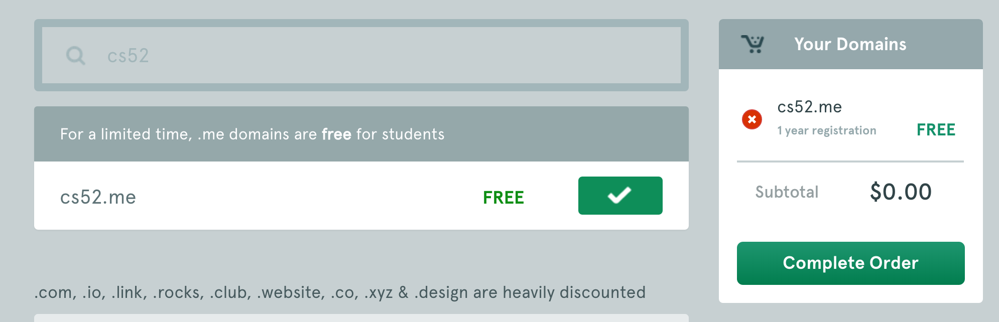
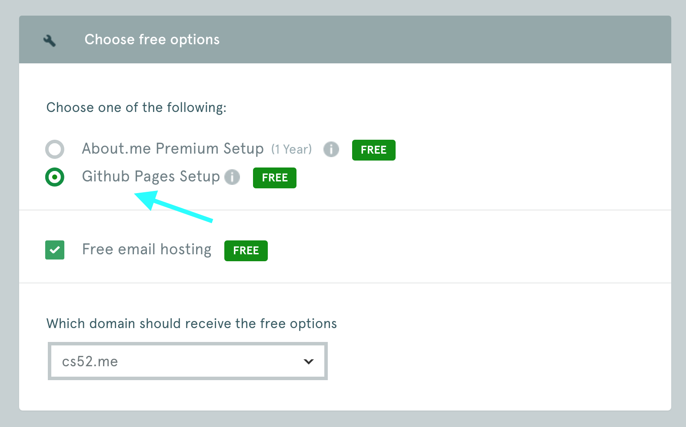
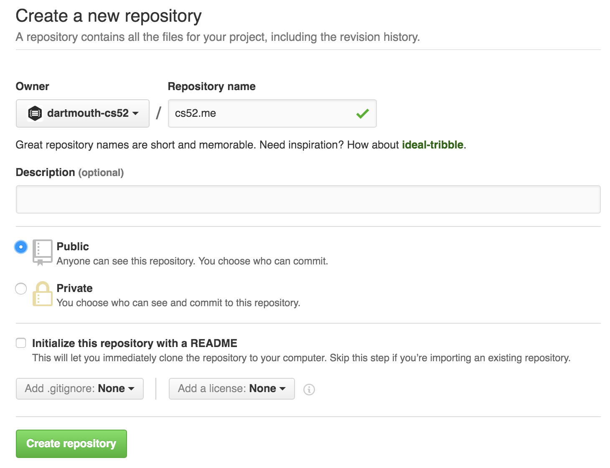
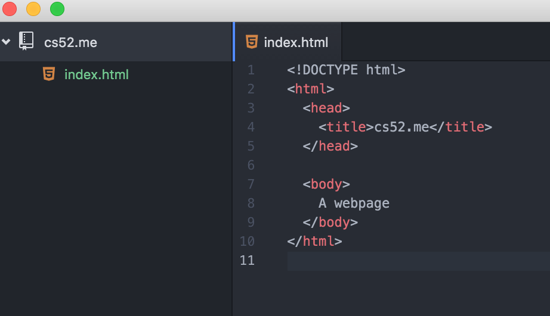

# DALI Collaborative Coding and Design Developer Details

We're going to be making a website from domain name to design and html/css. Then we will add an pin and image onto a shared map with a link to your new website.

(some screenshot examples are from cs52)


## Steps At a Glance
Here's what we're going to do!

### Domain Setup

1. Setup Local Dev environment
1. Download some tools
1. Register a domain
1. Create and clone a github repo
1. Create a webpage
1. Set up hosting and DNS

<!--
#### Basic git
1. Clone this repo
1. Create a `branch`
1. Make some edits
  - Modify `index.html`
  - Put a picture of yourself in your repo
  - add a location to the map
1. `add` a file to source control
1. `commit` your changes locally
1. `pull` to update from github
1. if you need to resolve conflicts
  - fix the conflicts
  - add the fixed files as you did previously
  - `commit`
1. `push` your changes to github

#### Branches
1. `pull` to update from github
1. Create a `branch` locally
1. Make some edits
1. `commit` your changes locally
1. `rebase` your changes on top of any updates from github

#### Pull Requests
1. `push` your feature branch to github
1. issue a Pull Request and approve it
1. pull request will merge our changes into the main branch
1. view our work!
-->

Key: <br />
🚀steps to definitely pay attention to <br/>
💻run this in Terminal<br />
🍸pro tip<br />


## Local Dev Environment

First things first.  You need a local development environment.  

*Why is this important you ask.  Couldn't I just copy code over to a server every time I make changes?  You could.  But imagine debugging,  every change you make you spend a few seconds maybe copying code over, or pushing git.  This time adds up.  Save yourself hours of your life, get your laptop set up for coding now.*


## DALI Tools! ##


🚀Install [atom](http://atom.io).  Atom is a code editor.  Atom is an open source, made by Github
web technology written in html+css+javascript using a platform called [Electron](http://electron.atom.io/).  We'll be using Atom for coding and utilizing a lot of its plugins. After installing and starting up Atom, run: *Atom -> Install Shell Commands* to be able to run `atom` from the commandline.

🚀If you don't have it, install [Google Chrome](https://www.google.com/chrome/browser/desktop/).  Why?
Because we'll be using [Chrome Developer Tools](https://developers.google.com/web/tools/chrome-devtools/) for debugging.

🚀Install [GitHub Desktop](http://desktop.github.com).  We will be mostly using `git` from the commandline but installing the App gives you a nice tree visualization.


### OS X ###

🚀Install [Homebrew](http://brew.sh/).  This is a package manager for all things open source.
We will use `brew` extensively to setup your dev environment.

### Various Linux ###

Most of the directions through the class will be very similar on the various flavors of linux.  Mostly just replace any `brew` command with the package manager for your system (apt on Ubuntu or yum on Fedora).

### Windows ###

Windows is a trickier dev environment.  We'll try to provide directions but these may need revision.

In general though whenever we refer to 💻 Terminal you can just use ***Git Shell*** (which comes bundled with the GitHub app).  You may want to check out [Chocolatey](http://chocolatey.org) which is a package manager for Windows.

If you want to be brave you can try out the very new beta of [ubuntu in windows](https://blogs.msdn.microsoft.com/commandline/2016/04/06/bash-on-ubuntu-on-windows-download-now-3/) — no guarantees there.


## Command Line ##

We'll be doing a lot of commandline stuff.  We'll introduce stuff as we go, so do not fear, commandline is best.

If you are interested here's a tutorial that gives you more than enough to be a master:
[learn just enough commandline to be dangerous](https://www.learnenough.com/command-line-tutorial)

Here's some basics:

* `ls -la`  will list files in current directory
* `pwd`  will show current directory
* `cd  somedirectory`  will change directory to *somedirectory*
* `cp source target` will copy files
* `mv source target` will move
* `rm somefile` will remove that file (permanently, bypassing trash)
* `mkdir somedirectory` will create a folder (directory)

On OSX:

* `open somefile` will open the file in the default app associated with it
* `open somedirectory` will open that folder in Finder


## Register a Domain!

Lets start off the term right, with a domain of your own that you'll use throughout the course.

We'll use NameCheap as our registrar.  Namecheap is a good [net citizen](https://www.netneutrality.com/) and have free domains for students.

🚀go to: [https://nc.me/](https://nc.me/)
and lets register you a domain!


🚀I'm going to grab one for cs52 now too!



🚀When prompted choose Github Pages Setup


🚀Great, now we'll do the rest of the setup manually so when prompted to setup github — instead to do advance setup.


## Create a GitHub Repo

🚀 go to http://github.com  if you don't have an account, set one up! Use your .edu account and get the [GitHub Student Developer Pack](https://education.github.com/pack)

🚀 create a new repo for your domain, probably best to name it with your domain name.



Grab the URL for the repository (either SSH or HTML depending on how you have git setup.  If SSH gives you trouble just try HTML.)

**Note:**  the following are transcripts of MY terminal session while setting up **cs52.me** with my github URL.  You should replace anything with `cs52.me` with your own repo name and your github URL instead.


### Git global configs:
🚀 Setup your global config variables in *Terminal* if you haven't yet:

  💻`git config --global user.name "Jane Doe"`

  💻`git config --global user.email janedoe@example.com`

Ensure that the configs are set up with `cat ~/.gitconfig`. *Email* and *Name* should be filled out.

This is important, if you don't do this github won't really know who you are and you won't get credited for your commits.


## 1) Clone the Repository
**What this does:** The repository is what git uses to store your project's information. It contains commits and references to commits (more on this later). The folder on your computer becomes your *workspace*.

From the command line (where you will run all future commands):

1. 🚀 Navigate to where you want the repo to end up on your computer. For example:
```bash
💻 mkdir ~/Documents/DALI
💻 cd ~/Documents/DALI
```
1. 🚀 Clone the repo:
```bash
💻 git clone YOUR_REPO_URL
```
1. 🚀 change directory to this new workspace:
```bash
💻 cd YOUR_REPO_NAME
```


<!--
### Clone Repo

```bash
💻 git clone git@github.com:dartmouth-cs52/cs52.me.git
Cloning into 'cs52.me'...
warning: You appear to have cloned an empty repository.
Checking connectivity... done.
💻 cd cs52.me/
💻 pwd  #checking current working directory
/Users/tim/Sandbox/cs52.me
``` -->

### Create some HTML

```bash
💻 atom index.html
```
🚀basically just start Atom and create a file called `index.html` in your cloned workspace.




### Test Locally

```bash
💻 python -m SimpleHTTPServer 9000
Serving HTTP on 0.0.0.0 port 9000 ...
127.0.0.1 - - [09/Jun/2016 18:25:18] "GET / HTTP/1.1" 200 -
```
*If you are running python3 try: `python -m http.server 9000` instead.*

❓does anybody know what `127.0.0.1` is the address for?

Lets check out what we have made in Chrome: http://localhost:9000


Note: to quit the python server type: ctrl+c
(this is a default for many commandline processes).


### Now Add Some Content

* A picture of yourself
* Your name
* Where you’re from/where you live
* A short bio telling us about yourself (you might include/mention: design/programming applications you know, what you enjoy most about ui/ux design/development, why you’re excited to work with DALI.)
* Something interesting about yourself :-)

Go here to learn some HTML/CSS: http://learn.shayhowe.com/html-css/

🎆 Have fun with this part - experiment. To see your changes just refresh the page in your browser.

### Images
To insert a new image just put a .jpg or .png in an `images` folder and use the syntax in your html.

```

```

More here: http://learn.shayhowe.com/html-css/adding-media/#adding-images


## An Overview of Git
Now that you've made some changes to the site, we'll go over how to use git to add, commit, and push your changes. Git is a code version control system and allows you to have a named log of your changes to the code and a way to work on the same files together with other people. It is sort of like an offline google docs where you *commit* (explicitly name) every set of changes. [Here's a good resource](http://rogerdudler.github.io/git-guide/) but we'll do the basics here.


This is a good overview image for the things you'll be doing — it'll all make sense eventually.


### Git Add

**What this does:** The add step tells git which files from the workspace you want it to track, or add to the index.

  - 🚀**Check your status:** Use `git status` to see what git thinks you have been working on. If you see *untracked* that means git doesn't know that you want to commit those file.
  - 🚀**Add Untracked Files:** Use `git add filename` on those files to tell git to track them.
    - You might also used `git add .` to add all untracked files recursively from the current directory.
  - 🚀Go ahead a try to add your new files now. Run `git status` to make sure they are added.


```bash
💻 git status  #check and see what the story is
On branch master

Initial commit

Untracked files:
  (use "git add <file>..." to include in what will be committed)

  index.html

nothing added to commit but untracked files present (use "git add" to track)
💻 git add index.html  #lets track index.html
💻 git status  #check again -- I'm OCD with this
On branch master

Initial commit

Changes to be committed:
  (use "git rm --cached <file>..." to unstage)

  new file:   index.html


```

## 4) Git Commit
**What this does:** Committing files tells git that you want to name and save the changes you have made as a concrete *changeset*. For now this changeset is only saved locally in your local repository. Commits should represent one logical change in the repo and the commit message should make that change clear.

  - 🚀**Commit your changes:** ```git commit -am "i made some changes"```
    - ``-a`` means all changes
    - ``-m`` indicates that your commit message follows directly, a commit message is required.
  - Example of sample commit chains that adds new payments feature to an e-commerce website:
    - "Setup and initialize new Charge Table"
    - "Add API call to generate a new Charge"
    - "Add task that processes new charges"
    - "Add tests to make sure charge amounts are accurate between server and client"

```
💻 git commit -am "its hideous"   #please make yours prettier 😃
[master (root-commit) 93a5c69] its hideous
 1 file changed, 10 insertions(+)
 create mode 100644 index.html
```

### Git Branch

Ok, now we have a local commit!  However before we push our changes.. GitHub Pages requires that the git branch we use for their hosting is named `gh-pages`.

So lets rename our branch!

```bash
💻 git branch
 * master
💻 git branch -m master gh-pages
💻 git branch
 * gh-pages
```

### Git Push

```bash
💻 git push -u origin gh-pages
Counting objects: 3, done.
Delta compression using up to 8 threads.
Compressing objects: 100% (2/2), done.
Writing objects: 100% (3/3), 289 bytes | 0 bytes/s, done.
Total 3 (delta 0), reused 0 (delta 0)
To git@github.com:dartmouth-cs52/cs52.me.git
 * [new branch]      gh-pages -> gh-pages
```

### Default GitHub Pages Hosting

By default GitHub Pages, when it sees a branch named `gh-pages`, will publish it at `http://<github username>.github.io/<repository name>`.

You can make sure of this by going to Settings for your repository.


### CNAME hosting

But we want our domain!

Ok. Add another file to your local workspace named `CNAME`.  Inside this file put in just one line with your domain name.


🚀 Now you have to `git add` and `git commit` and `git push` this new file.  See [Git Add](#git-add) section (skip branching as thats a one time thing).

### DONE!

As soon as you `git push` your site should become available at your URL!  *Note: actually it might take up to 5 minutes for it to start working with your domain name as github pushes your content to various servers.*


### What About DNS?!?!

You didn't actually have to do any DNS setup,  what happened?

NameCheap set up all the right Domain Name Service Records automatically for you. In NameCheap you can inspect what it did:


Take a look at your settings in your Namecheap Dashboard.

Note the 2 IP addresses in the `A Record` fields,  those are github servers.

🚀 Try doing a reverse DNS lookup (IP address to name):

```bash
💻 host 192.30.252.153
153.252.30.192.in-addr.arpa domain name pointer pages.github.com.
```

Wait,  but how does pages.github.com know? Does that machine serve lots of addresses?

Yes, those IPs point to load balancers that direct requests based on the transport packet which happens to have the domain name requested in it.  This is where that magical `CNAME` file comes in.  That tells GitHub Pages that your repository should be served when requests come in for that domain. :cool:


## Add Yourself To The DALI 17W Map!

Now that you have a personal page up.  Let's add

### Clone The Repo

1. 🚀Clone the repo:
`git clone https://github.com/dali-lab/17W-mappy.git`
1. 🚀change directory to this new workspace:
`cd 17W-mappy`
